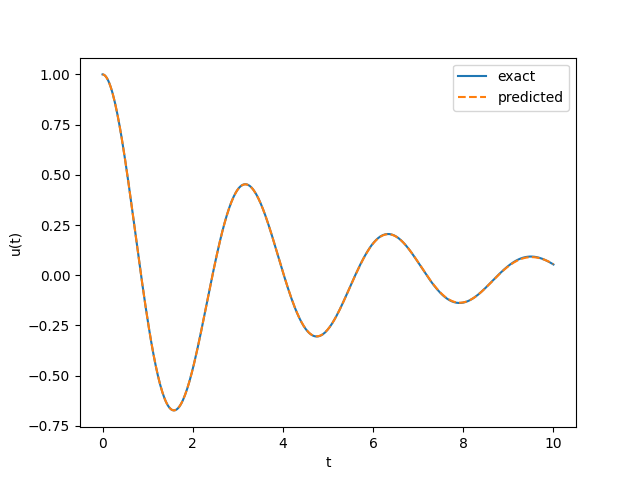
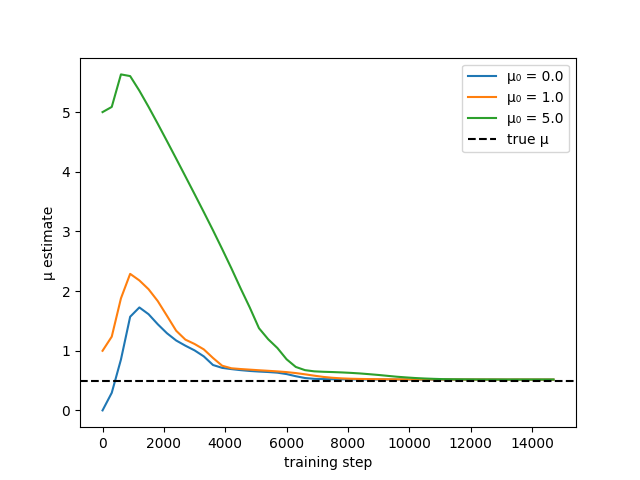
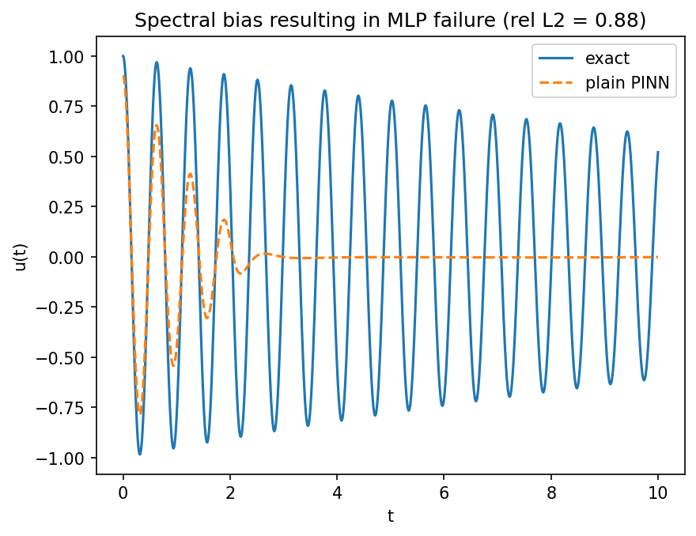
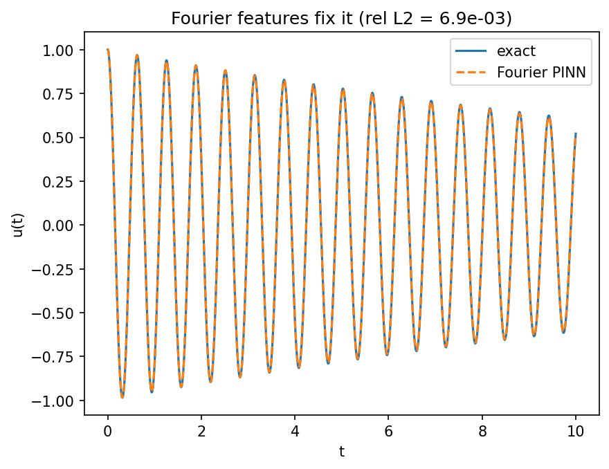

# Physics-Informed Neural Networks for Forward and Inverse ODE Problems

A from-scratch implementation of physics-informed neural networks (PINNs) in **Keras 3 / TensorFlow**, built to study where the method works, where it fails, and why. The project uses a damped harmonic oscillator as a controlled testbed to cover three distinct regimes: solving a known equation (forward), recovering unknown physics from data (inverse), and a research investigation into spectral bias.

No high-level PDE library (e.g. DeepXDE) is used — the residual, the nested-autodiff derivatives, and the training loops are implemented directly, to demonstrate the underlying mechanics.

---

## Motivation

A PINN learns a function that is constrained to obey a differential equation, by penalising the network whenever its own autodiff-computed derivatives violate the governing physics. The same machinery that solves a *forward* problem also solves the *inverse* problem — recovering a hidden physical parameter from sparse, noisy observations — with almost no change in code. This repository is organised to make that progression explicit, and to be honest about the method's limitations rather than showing only success cases.

The governing equation throughout is the damped harmonic oscillator:

$$ m\ddot{u} + \mu\dot{u} + k u = 0, \qquad u(0) = u_0,\ \dot{u}(0) = v_0 $$

which has a closed-form underdamped solution used for validation and for generating synthetic measurements.

---

## Repository structure

```
.
├── module1_forward.py      # Forward problem: solve a known ODE, validate vs exact solution
├── module2_inverse.py      # Inverse problem: recover hidden damping from noisy data
├── module3_spectral.py     # Research: spectral bias + Fourier-feature fix (in progress)
├── figures/                # Generated plots
├── docs/
│   └── pinn_project.pdf     # Full theory write-up and project brief
├── requirements.txt
└── README.md
```

---

## Results

### Module 1 — Forward problem
A PINN solves the oscillator from physics and initial conditions alone (no solution data), validated against the analytical solution.

- Relative L² error: **~1×10⁻²** (Adam, 20k steps)
- Optional Adam → L-BFGS polishing tightens this further.



### Module 2 — Inverse problem
The damping coefficient μ is hidden and recovered as a trainable variable, jointly with the solution field, from ~20 sparse noisy measurements.

- Recovered **μ = 0.51** (true value 0.5) from 20 points at 3% noise.
- **Noise robustness:** error degrades smoothly and roughly proportionally with noise level.
- **Data-count identifiability threshold:** recovery is accurate at 20–40 points but fails catastrophically below ~10 — a non-identifiability result, not an optimiser failure.

| Data points | Recovered μ (noise 0.05) |
|---|---|
| 5  | ~8.9 (fails) |
| 10 | ~5.9 (fails) |
| 20 | ~0.52 |
| 40 | ~0.51 |



### Module 3 — Spectral bias
A high-frequency version of the problem (ω = 10, ~16 cycles over the domain) is used to expose spectral bias, then fixed with a Fourier-feature input embedding. The *only* architectural change between the two runs below is a single non-trainable sin/cos embedding layer inserted after input rescaling.

- Plain MLP at ω = 10: relative L² = **0.88** — the network cannot represent the fast oscillation and collapses toward a near-flat curve.
- With Fourier features (σ = 5): relative L² = **6.9×10⁻³**, a **127× improvement** from that one layer.

| | plain MLP | + Fourier (σ = 5) |
|---|---|---|
| rel. L² at ω = 10 | 0.88 (fails) | 0.0069 (works) |

<p align="center">
  
  
</p>

*Left: a plain PINN exhibits spectral bias — it fits the low-frequency envelope but not the oscillation. Right: an identical network with a Fourier-feature embedding tracks the solution.*

---

## Installation

```bash
git clone https://github.com/<your-username>/pinn-oscillator.git
cd pinn-oscillator
pip install -r requirements.txt
```

**Requirements:** Python 3.10+, Keras 3, TensorFlow, NumPy, SciPy, Matplotlib. The TensorFlow backend must be selected before importing Keras (handled at the top of each script via `KERAS_BACKEND=tensorflow`).

---

## Usage

Each module is a self-contained script:

```bash
python module1_forward.py     # forward solve + validation + residual map + width/depth ablation
python module2_inverse.py     # inverse recovery + robustness sweeps + basin of attraction
python module3_spectral.py    # spectral-bias study + Fourier fix + classical baseline
```

Module 2 runs several experiments (basin of attraction, headline recovery with L-BFGS polish, noise and data-count sweeps) and takes a few minutes at the default 15k epochs per run; lower the `epochs` argument for faster trends.

---

## Key implementation details

- **Derivatives** are computed with nested `tf.GradientTape` contexts to obtain the second derivative required by the residual.
- **Activation** is `tanh` throughout (smooth and infinitely differentiable), since the loss depends on second derivatives — `relu` would zero out the curvature term.
- **Inverse problem:** the unknown parameter is a `tf.Variable` added to the optimiser's variable list, so it is learned by the same gradient descent that trains the weights.
- **Fair experiments:** each sweep run builds a fresh model and a fresh parameter guess, so comparisons are not contaminated by prior training.

A full derivation of the theory and the project brief is in [`docs/pinn_project.pdf`](docs/pinn_project.pdf).

---

## References

1. Raissi, Perdikaris & Karniadakis (2019). *Physics-informed neural networks.* J. Comput. Phys. 378:686–707.
2. Tancik et al. (2020). *Fourier features let networks learn high frequency functions in low dimensional domains.* NeurIPS.
3. Wang, Teng & Perdikaris (2021). *Understanding and mitigating gradient flow pathologies in PINNs.* SIAM J. Sci. Comput.

---

## License

Released under the MIT License — see `LICENSE`.
